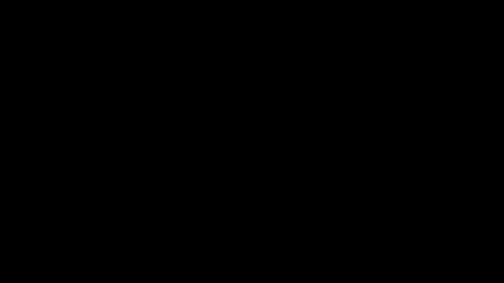

# 1. Scene과 Mobject

> 예제: [`scenes/ch01_basics.py`](scenes/ch01_basics.py)

## 핵심 개념

Manim 영상은 이렇게 만들어집니다.

```
Scene(장면)  ─ construct() 안에 연출을 순서대로 쓴다
  └─ Mobject(화면 객체)  ─ Circle, Text, Axes ... 전부 Mobject
       └─ self.play(Animation)  ─ Mobject를 움직이고, 한 번의 play가 영상 한 토막이 된다
```

- **좌표계**: 화면 중앙이 `ORIGIN (0,0,0)`이고, 기본 화면 크기는 가로 약 14.2, 세로 8입니다.
- **방향 상수**: `UP`, `DOWN`, `LEFT`, `RIGHT`, `UL`, `UR`, `DL`, `DR`은 모두 numpy 벡터입니다. `LEFT * 3 + UP`처럼 더해서 씁니다.
- **VGroup**: 여러 Mobject를 하나로 묶습니다. 묶음 단위로 이동, 정렬, 색칠, 애니메이션을 할 수 있습니다.

## HelloManim: 가장 작은 Scene



```python
class HelloManim(Scene):
    def construct(self):
        circle = Circle(radius=1.5, color=BLUE, fill_opacity=0.5)
        square = Square(side_length=3, color=ORANGE, fill_opacity=0.5)
        self.play(Create(circle))
        self.play(Transform(circle, square))
        self.wait()
```

```bash
uv run manim -pql scenes/ch01_basics.py HelloManim
```

## ShapesAndLayout: 도형과 배치


자주 쓰는 배치 메서드 (`mobject/mobject.py`):

| 메서드 | 하는 일 |
|---|---|
| `move_to(point or mob)` | 중심을 해당 위치로 |
| `shift(vec)` | 상대 이동 |
| `next_to(mob, DIR, buff=)` | 다른 객체 옆에 붙이기 |
| `to_edge(UP)` / `to_corner(UR)` | 화면 가장자리나 모서리로 |
| `align_to(mob, LEFT)` | 한쪽 끝을 맞추기 |
| `VGroup.arrange(RIGHT, buff=)` | 한 줄로 정렬 |
| `VGroup.arrange_in_grid(rows=, cols=)` | 격자로 정렬 |
| `scale`, `rotate`, `flip`, `stretch` | 크기, 회전, 뒤집기, 늘리기 |
| `set_color`, `set_fill`, `set_stroke`, `set_color_by_gradient` | 색 |

## BraceAnnotation: 주석 달기 (공식 예제)


`Brace(mob, direction)`는 객체 옆에 중괄호를 붙이고, `brace.get_text()`나 `get_tex()`로 라벨을 붙입니다.

## BooleanShapes: 도형 불리언 연산


`Union`, `Intersection`, `Difference`, `Exclusion`으로 두 도형을 합치거나 빼서 새 도형을 만듭니다.

## 🧩 빈칸 실습

위에서 본 예제 코드에 빈칸을 뚫었습니다. 실습 사이트(`index.html`)에서 열면 바로 채우고 채점할 수 있습니다.
GitHub에서 읽을 때는 `⟦정답⟧` 부분이 빈칸입니다.

```exercise
id: ch01-hello
title: 원을 그리고 사각형으로 바꾸기
scene: ch01_basics.py HelloManim
gif: HelloManim
hint: 선을 그리며 등장하는 애니메이션은 Create, 모양을 바꾸는 애니메이션은 Transform입니다.
---
from manim import *


class HelloManim(Scene):
    """가장 작은 Scene: 원 하나를 그리고 사각형으로 바꾼다."""

    def construct(self):
        circle = ⟦Circle⟧(radius=1.5, color=BLUE, fill_opacity=0.5)
        square = Square(side_length=3, color=ORANGE, fill_opacity=0.5)

        self.play(⟦Create⟧(circle))
        self.play(⟦Transform⟧(circle, square))
        self.⟦wait⟧()
```

```exercise
id: ch01-layout
title: 도형을 한 줄로 늘어놓고 라벨 붙이기
scene: ch01_basics.py ShapesAndLayout
gif: ShapesAndLayout
hint: VGroup.arrange(방향)으로 정렬하고, next_to(기준, 방향)로 옆에 붙이고, to_edge(UP)로 화면 위쪽에 붙입니다.
---
from manim import *


class ShapesAndLayout(Scene):
    """도형 만들기 + 배치(arrange / next_to / to_edge) + 색."""

    def construct(self):
        shapes = VGroup(
            Circle(radius=0.8, color=BLUE, fill_opacity=0.6),
            Square(side_length=1.6, color=GREEN, fill_opacity=0.6),
            Triangle(color=RED, fill_opacity=0.6).scale(1.1),
            RegularPolygon(n=6, color=YELLOW, fill_opacity=0.6),
            Star(n=5, outer_radius=0.9, color=PURPLE, fill_opacity=0.6),
        ).⟦arrange⟧(RIGHT, buff=0.5)  # 가로로 0.5 간격 정렬

        names = ["Circle", "Square", "Triangle", "RegularPolygon", "Star"]
        labels = VGroup(*[Text(n, font_size=20).⟦next_to⟧(s, ⟦DOWN⟧) for n, s in zip(names, shapes)])

        title = Text("Mobject = 화면에 나오는 모든 것", font_size=36).⟦to_edge⟧(UP)

        self.play(Write(title))
        self.play(⟦LaggedStart⟧(*[GrowFromCenter(s) for s in shapes], lag_ratio=0.2))
        self.play(FadeIn(labels, shift=UP * 0.3))
        self.wait()

        # 그리드 배치와 그라데이션 색
        self.play(FadeOut(labels))
        self.play(shapes.animate.⟦arrange_in_grid⟧(rows=2, buff=0.6).set_color_by_gradient(BLUE, PINK))
        self.wait()
```

```exercise
id: ch01-brace
title: 선분에 중괄호로 주석 달기
scene: ch01_basics.py BraceAnnotation
gif: BraceAnnotation
hint: 중괄호 클래스는 Brace이고, 중괄호에 글을 붙이는 메서드는 get_text / get_tex 입니다.
---
from manim import *


class BraceAnnotation(Scene):
    """점, 선, 중괄호(Brace)로 주석 달기. (공식 예제 BraceAnnotation)"""

    def construct(self):
        dot = Dot([-2, -1, 0])
        dot2 = Dot([2, 1, 0])
        line = Line(dot.get_center(), dot2.get_center()).set_color(ORANGE)

        b1 = ⟦Brace⟧(line)
        b1text = b1.⟦get_text⟧("Horizontal distance")
        b2 = Brace(line, direction=line.copy().rotate(PI / 2).get_unit_vector())
        b2text = b2.⟦get_tex⟧("x-x_1")

        self.play(Create(line), FadeIn(dot, dot2))
        self.play(⟦GrowFromCenter⟧(b1), Write(b1text))
        self.play(GrowFromCenter(b2), Write(b2text))
        self.wait()
```

## ✍️ 직접 해보기

1. `HelloManim`에서 사각형 대신 `Star(n=7)`로 변하게 바꿔 보세요.
2. `ShapesAndLayout`에서 `arrange(RIGHT)`를 `arrange(DOWN)`으로 바꾸면 라벨이 어떻게 될까요? 라벨이 도형 오른쪽에 붙게 고쳐 보세요.
3. 원 두 개의 `Intersection`으로 렌즈 모양을 만들고, 그 위에 `Brace`로 폭을 표시해 보세요.
4. `-s` 옵션으로 마지막 프레임만 뽑아서 레이아웃을 빠르게 확인하는 습관을 들이세요.
