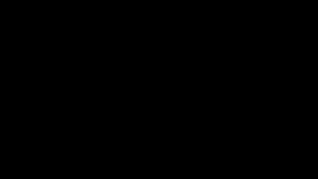
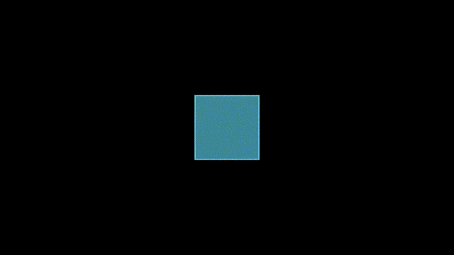
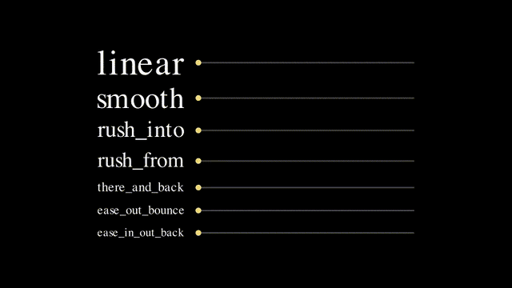
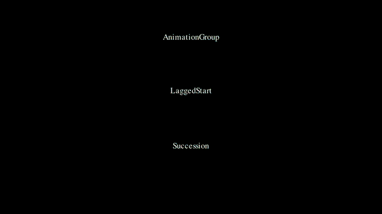
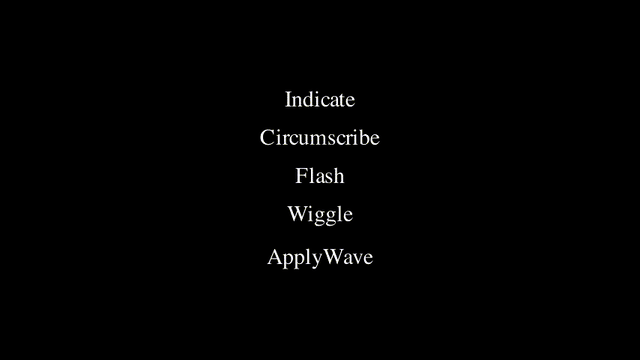

# 2. 애니메이션

예제 원본: [`scenes/ch02_animations.py`](scenes/ch02_animations.py)

## 핵심 개념

애니메이션은 모두 `애니메이션(대상, 옵션)` 형태의 객체이고, `self.play()`에 넣어야 재생됩니다. 재생 시간, 속도 곡선 같은 옵션은 애니메이션마다 공통으로 줄 수 있습니다.

- `self.play(anim1, anim2, ...)`: anim1, anim2, ... 를 동시에 재생
- `run_time=초`: 재생 시간
- `rate_func=함수`: 시간에 따른 진행 속도 곡선
- `lag_ratio=`: 하위 객체들 사이의 시간차
- `self.add(mob)` / `self.remove(mob)`: 애니메이션 없이 바로 추가 / 제거
- `self.wait(초)`: 멈춤
  - updater(4장)는 멈춰 있는 동안에도 계속 동작

## BasicAnimations: 등장 → 변형 → 강조 → 퇴장

Manim의 애니메이션은 모두 `애니메이션(대상)` 형태이고, `self.play()`에 넣으면 재생됩니다. 객체를 등장시키는 애니메이션, 모양을 바꾸는 애니메이션, 시선을 모으는 애니메이션, 퇴장시키는 애니메이션이 각각 여러 개 있습니다. 같은 `play()`에 여러 개를 넣으면 동시에 재생됩니다. 이 예제의 `say()`는 화면 아래 캡션을 바꾸는 작은 도우미 함수입니다.

- `Create(mob)`: 테두리를 따라 그리며 등장
  - 비슷한 등장 애니메이션: `Write`, `DrawBorderThenFill`, `FadeIn`, `GrowFromCenter`, `GrowArrow`, `SpinInFromNothing`
- `Transform(a, b)`: a의 모양을 b의 모양으로 변경
  - 화면의 객체는 여전히 a
- `ReplacementTransform(a, b)`: a를 b로 교체
  - 이후 코드에서는 b를 사용
  - 비슷한 변형 애니메이션: `TransformFromCopy`, `FadeTransform`, `Swap`
- `Indicate(mob)`: 잠깐 커지며 노랗게 강조
  - 비슷한 강조 애니메이션: `Circumscribe`, `Flash`, `Wiggle`
- `FadeOut(mob, shift=)`: 서서히 사라짐
  - `shift=DOWN`이면 아래로 미끄러지며 사라짐
  - `FadeIn`도 같은 옵션 사용
  - 비슷한 퇴장 애니메이션: `Uncreate`, `Unwrite`, `ShrinkToCenter`



```exercise
id: ch02-basic
title: 등장 → 변형 → 강조 → 퇴장
scene: ch02_animations.py BasicAnimations
gif: BasicAnimations
hint: ReplacementTransform 뒤에는 tri를 다룹니다. 퇴장 방향은 shift= 인자로 줍니다.
---
from manim import *


class BasicAnimations(Scene):
    """등장 / 변형 / 퇴장 애니메이션 한 바퀴."""

    def construct(self):
        sq = Square(color=BLUE, fill_opacity=0.5)
        circ = Circle(color=RED, fill_opacity=0.5)
        tri = Triangle(color=GREEN, fill_opacity=0.5).scale(1.3)
        caption = Text("", font_size=28).to_edge(DOWN)

        def say(msg):
            return Transform(caption, Text(msg, font_size=28).to_edge(DOWN))

        self.add(caption)
        self.play(⟦Create⟧(sq), say("Create"))  # 사각형을 그리며 등장
        self.play(⟦Transform⟧(sq, circ), say("Transform(sq, circ)"))  # 사각형을 원 모양으로 변형 (화면의 객체는 여전히 sq)
        # ReplacementTransform: 이후로는 tri 변수로 다룬다
        self.play(⟦ReplacementTransform⟧(sq, tri), say("ReplacementTransform"))  # sq를 tri로 교체 (이후에는 tri 사용)
        self.play(⟦Indicate⟧(tri), say("Indicate"))  # 잠깐 커지며 강조
        self.play(FadeOut(tri, ⟦shift⟧=DOWN), say("FadeOut(shift=DOWN)"))  # 아래로 미끄러지며 사라짐
        self.wait(0.5)
```

## AnimateSyntax: `.animate`

`mob.animate` 뒤에 메서드를 호출하면, 메서드를 실행한 결과 상태까지 부드럽게 이동하는 애니메이션이 됩니다. 이동, 회전, 색 변경처럼 이미 알고 있는 메서드를 그대로 애니메이션으로 쓸 수 있어서 가장 자주 쓰는 문법입니다.

- `mob.animate.메서드()`: 메서드 결과까지 부드럽게 변하는 애니메이션
  - 메서드를 이어 붙일 수 있음. 예: `mob.animate.shift(UP).scale(2)`
  - `mob.animate(run_time=2, rate_func=...)`처럼 괄호를 붙이면 옵션 지정
  - 시작과 끝 상태만 보간하므로 `rotate(PI)`처럼 끝 모양이 같으면 도는 모습이 안 보임. 회전 과정은 `Rotate(mob, PI)`로 표현
- `rotate(각도)`: 회전
  - 각도는 라디안. 예: `PI / 4`가 45도
- `set_color(색)`: 색 변경
- `there_and_back`: 목표까지 갔다가 제자리로 돌아오는 rate function
- `mob.save_state()`: 현재 상태 저장
- `Restore(mob)`: 저장한 상태로 되돌리는 애니메이션



```exercise
id: ch02-animate
title: `.animate`로 이동, 회전, 복원하기
scene: ch02_animations.py AnimateSyntax
gif: AnimateSyntax
hint: .animate 뒤에 메서드를 이어 붙입니다. 상태 저장은 save_state, 복원 애니메이션은 Restore 입니다.
---
from manim import *


class AnimateSyntax(Scene):
    """`.animate` : 메서드 호출을 그대로 애니메이션으로."""

    def construct(self):
        sq = Square(color=BLUE, fill_opacity=0.7)
        self.add(sq)

        self.play(sq.⟦animate⟧.shift(LEFT * 3))  # 왼쪽으로 3만큼 이동하는 애니메이션
        self.play(sq.animate.⟦rotate⟧(PI / 4).⟦set_color⟧(YELLOW))  # 45도 회전하면서 노란색으로
        self.play(sq.animate.scale(0.5).to_corner(UR))
        self.play(sq.animate(run_time=2, rate_func=⟦there_and_back⟧).move_to(ORIGIN))  # 원점까지 갔다가 제자리로 돌아오기

        # 상태 저장 / 복원
        sq.⟦save_state⟧()  # 현재 상태 저장
        self.play(sq.animate.scale(3).set_opacity(0.2))
        self.play(⟦Restore⟧(sq))  # 저장한 상태로 되돌리기
        self.wait(0.5)
```

## RateFunctions: 움직임의 "느낌"

rate function은 흐른 시간(0→1)을 진행도(0→1)로 바꾸는 함수입니다. 같은 거리를 같은 시간에 움직여도 rate function에 따라 출발과 도착의 느낌이 달라집니다. 이 예제는 일곱 가지를 나란히 비교합니다.

- `smooth`: 천천히 출발해서 천천히 멈춤
  - 기본값
- `linear`: 처음부터 끝까지 같은 속도
- `rush_into` / `rush_from`: 끝으로 갈수록 빨라짐 / 처음에 빠르고 점점 느려짐
- `there_and_back`: 갔다가 돌아옴
- `rate_functions.ease_out_bounce`, `rate_functions.ease_in_out_back`: CSS 이징 계열
  - `ease_*` 함수는 `rate_functions` 모듈 안에 있어서 모듈 이름을 붙여야 함
  - 위의 `smooth`, `linear`, `rush_into` 등은 `from manim import *`만으로 사용 가능
- `.animate(rate_func=f)`: 애니메이션에 rate function 지정
- `self.play(..., run_time=초)`: 재생 시간 지정
- `line.get_end()` / `line.get_start()`: 선분의 끝점 / 시작점



```exercise
id: ch02-rate
title: rate function 7개 비교하기
scene: ch02_animations.py RateFunctions
gif: RateFunctions
hint: ease_ 계열은 rate_functions 모듈에 들어 있습니다. .animate(...) 괄호 안에 rate_func=를 줍니다.
---
from manim import *


class RateFunctions(Scene):
    """rate_func: 같은 이동이라도 '느낌'을 바꾸는 이징 함수."""

    def construct(self):
        rf = ⟦rate_functions⟧  # ease_* 함수가 들어 있는 모듈
        funcs = [⟦linear⟧, ⟦smooth⟧, rush_into, rush_from, there_and_back, rf.ease_out_bounce, rf.ease_in_out_back]  # 등속 / 기본값(부드럽게 출발, 부드럽게 정지)
        rows = VGroup()
        for f in funcs:
            label = Text(f.__name__, font_size=22).set_width(2.4)
            dot = Dot(color=YELLOW)
            track = Line(LEFT * 3, RIGHT * 3, stroke_opacity=0.3)
            dot.move_to(track.get_start())
            rows.add(VGroup(label, track, dot))
        for r in rows:
            r[0].next_to(r[1], LEFT, buff=0.4)
        rows.arrange(DOWN, buff=0.35).move_to(ORIGIN)
        self.add(rows)

        self.play(
            *[r[2].animate(⟦rate_func⟧=f).move_to(r[1].⟦get_end⟧()) for r, f in zip(rows, funcs)],  # 점마다 다른 속도 곡선으로 선분 끝까지 이동
            ⟦run_time⟧=3,  # 3초 동안 재생
        )
        self.wait(0.5)
```

## Composition: 애니메이션 조합

여러 애니메이션을 한 덩어리로 묶어서 재생 순서를 정합니다. 모두 동시에 할지, 조금씩 겹치며 차례로 할지, 하나씩 끝내고 다음으로 넘어갈지를 고를 수 있습니다. 예제의 `*[... for s in row]`는 리스트를 풀어서 인자 여러 개로 넘기는 파이썬 문법입니다.

- `AnimationGroup(*anims)`: 모두 동시에 재생
- `LaggedStart(*anims, lag_ratio=0.3)`: 겹치며 차례로 재생
  - `lag_ratio=0.3`이면 앞의 것이 30% 진행됐을 때 다음 것 시작
- `Succession(*anims)`: 앞의 것이 끝나야 다음 것 시작
- `LaggedStartMap(FadeIn, group)`: 그룹의 원소마다 같은 애니메이션을 적용해서 LaggedStart



```exercise
id: ch02-compose
title: 동시에 / 겹치며 / 차례로
scene: ch02_animations.py Composition
gif: Composition
hint: 동시에 = AnimationGroup, 겹치며 차례로 = LaggedStart, 완전히 하나씩 = Succession
---
from manim import *


class Composition(Scene):
    """AnimationGroup / LaggedStart / Succession 비교."""

    def construct(self):
        def make_row(y):
            return VGroup(*[Square(0.6, fill_opacity=0.8) for _ in range(6)]).arrange(RIGHT).shift(y * UP)

        rows = [make_row(2), make_row(0), make_row(-2)]
        rows[0].set_color(BLUE)
        rows[1].set_color(GREEN)
        rows[2].set_color(RED)
        labels = VGroup(
            Text("AnimationGroup", font_size=22),
            Text("LaggedStart", font_size=22),
            Text("Succession", font_size=22),
        )
        for lab, row in zip(labels, rows):
            lab.next_to(row, UP, buff=0.15)
        self.add(labels)

        self.play(⟦AnimationGroup⟧(*[GrowFromCenter(s) for s in rows[0]]))  # 모두 동시에
        self.play(⟦LaggedStart⟧(*[GrowFromCenter(s) for s in rows[1]], ⟦lag_ratio⟧=0.3))  # 30%씩 겹치며 차례로
        self.play(⟦Succession⟧(*[GrowFromCenter(s) for s in rows[2]]), run_time=2)  # 하나씩 끝나고 다음 것
        self.wait(0.5)
```

## Emphasis: 강조

이미 화면에 있는 객체에 시선을 모으는 애니메이션입니다. 강조가 끝나면 객체는 원래 모습으로 돌아옵니다.

- `Indicate(mob)`: 잠깐 커지면서 노랗게
- `Circumscribe(mob)`: 테두리를 따라 선이 한 바퀴 돎
- `Flash(점, color=)`: 지정한 위치에서 빛이 퍼짐
  - 객체가 아니라 위치를 받음. 예: `Flash(dot.get_center())`
- `Wiggle(mob)`: 좌우로 흔들림
- `ApplyWave(mob)`: 물결이 지나감
- `FocusOn(점)`: 스포트라이트
- `ShowPassingFlash(선)`: 선을 따라 빛이 이동
- `Blink(mob)`: 깜빡임



```exercise
id: ch02-emph
title: 강조 애니메이션 다섯 가지
scene: ch02_animations.py Emphasis
gif: Emphasis
hint: 화면에 적힌 글자가 곧 애니메이션 이름입니다.
---
from manim import *


class Emphasis(Scene):
    """강조 애니메이션 모음."""

    def construct(self):
        items = VGroup(*[Text(t, font_size=36) for t in ["Indicate", "Circumscribe", "Flash", "Wiggle", "ApplyWave"]])
        items.arrange(DOWN, buff=0.5)
        self.add(items)

        self.play(⟦Indicate⟧(items[0]))  # 잠깐 커지며 노랗게
        self.play(⟦Circumscribe⟧(items[1]))  # 테두리를 따라 선이 한 바퀴
        self.play(⟦Flash⟧(items[2].get_right() + RIGHT * 0.3, color=YELLOW))  # 글자 오른쪽 위치에서 빛이 퍼짐
        self.play(⟦Wiggle⟧(items[3]))  # 좌우로 흔들림
        self.play(⟦ApplyWave⟧(items[4]))  # 물결이 지나감
        self.wait(0.5)
```

## ✍️ 직접 해보기

1. `BasicAnimations`의 `Transform`을 `FadeTransform`으로 바꿔서 차이를 보세요.
2. `RateFunctions`에 `rate_functions.ease_in_out_elastic`과 `wiggle`을 추가해 보세요.
3. 정사각형 9개를 3×3 격자로 만들고, 가운데에서 바깥으로 퍼지듯 `LaggedStart`로 등장시켜 보세요. 중심과의 거리로 정렬한 뒤 넣으면 됩니다.
4. `sq.animate.rotate(PI)`와 `Rotate(sq, PI)`를 나란히 재생해서 차이를 직접 확인해 보세요.
