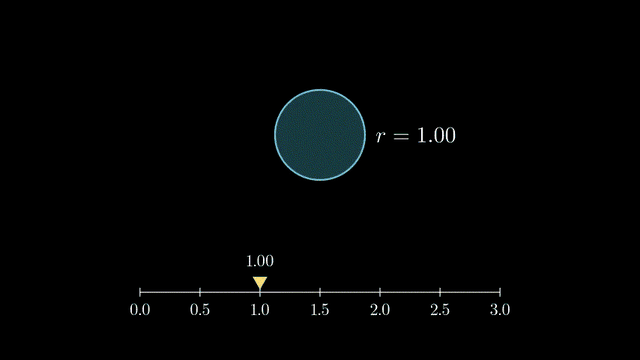
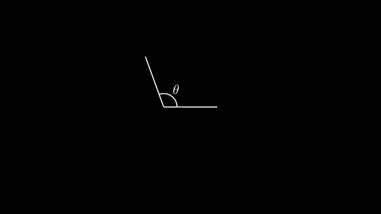
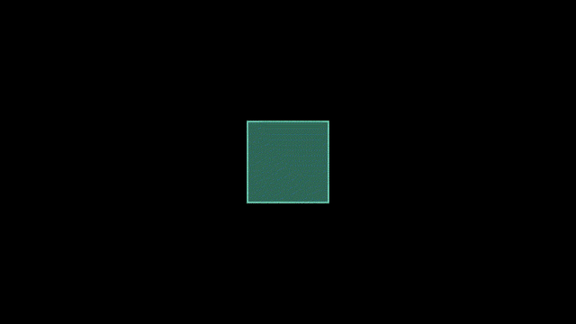
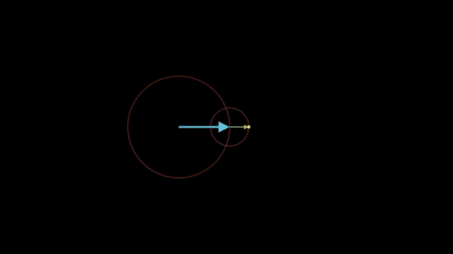

# 4. Updater와 ValueTracker

> 예제: [`scenes/ch04_updaters.py`](scenes/ch04_updaters.py)

**이 장이 Manim에서 가장 중요합니다.** "A가 움직이면 B가 따라간다"는 관계를 선언해 두면, 애니메이션 하나만 돌려도 연결된 모든 객체가 같이 움직입니다.

## 세 가지 도구

| 도구 | 형태 | 언제 |
|---|---|---|
| `mob.add_updater(lambda m: ...)` | 매 프레임마다 기존 객체를 **수정** | 위치나 값만 바뀔 때 (가볍다) |
| `always_redraw(lambda: NewMob(...))` | 매 프레임마다 객체를 **새로 생성** | 모양 자체가 바뀔 때 (편하지만 무겁다) |
| `mob.add_updater(lambda m, dt: ...)` | 프레임 사이 시간 `dt`를 받음 | 애니메이션 없이 계속 움직일 때 (회전, 흐름) |

그리고 **`ValueTracker`**는 화면에 보이지 않는 숫자 변수입니다. `tracker.animate.set_value(x)`로 이 값을 바꾸면, 이 값을 읽는 모든 updater가 따라 움직입니다.

## ValueTrackerBasics



```python
t = ValueTracker(1)
pointer.add_updater(lambda m: m.next_to(line.n2p(t.get_value()), UP))
circle = always_redraw(lambda: Circle(radius=t.get_value()))
self.add(pointer, circle)
self.play(t.animate.set_value(2.5))     # 이 한 줄로 포인터, 숫자, 원이 모두 움직임
```

## MovingAngle (공식 예제)



`x.become(new_mob)`: 기존 객체를 새 객체 모양으로 통째로 바꿉니다. updater 안에서 자주 씁니다.

## DtUpdater



```python
square.add_updater(lambda m, dt: m.rotate(dt * PI / 2))  # 초당 90도
self.wait(2)          # wait 중에도 돈다
square.clear_updaters()
```

## Epicycles: 미니 푸리에 에피사이클



`TracedPath(dot.get_center)`는 점이 지나간 자취를 그립니다. 회전하는 벡터를 몇 개 이어 붙이면 푸리에 급수 그림이 됩니다. `manimations` 프로젝트의 `src/manimations/fourier_*.py`가 이 원리를 쓰고 있습니다.

## 자주 하는 실수

- **updater를 붙인 객체를 `self.add()` 하지 않음**: 화면에 없는 객체는 업데이트되지 않습니다.
- **`always_redraw` 객체에 `.animate` 사용**: 매 프레임 새로 만들어지므로 효과가 사라집니다. tracker를 움직이세요.
- **lambda가 반복문 변수를 캡처**: `for i in ...: lambda m: ... i ...`는 모두 마지막 `i`를 봅니다. `lambda m, i=i: ...`로 고정하세요.
- **updater 해제를 잊음**: 이후 애니메이션과 충돌하면 `mob.clear_updaters()` 또는 `mob.suspend_updating()`을 쓰세요.

## 🧩 빈칸 실습

위에서 본 예제 코드에 빈칸을 뚫었습니다. 실습 사이트(`index.html`)에서 열면 바로 채우고 채점할 수 있습니다.
GitHub에서 읽을 때는 `⟦정답⟧` 부분이 빈칸입니다.

```exercise
id: ch04-tracker
title: ValueTracker 하나로 여러 객체 움직이기
scene: ch04_updaters.py ValueTrackerBasics
gif: ValueTrackerBasics
hint: 값을 읽을 땐 get_value(), 애니메이션으로 바꿀 땐 t.animate.set_value(x). 모양이 바뀌면 always_redraw.
---
from manim import *


class ValueTrackerBasics(Scene):
    """ValueTracker 하나로 여러 객체를 동시에 구동한다."""

    def construct(self):
        t = ⟦ValueTracker⟧(1)  # 화면에 안 보이는 '숫자 변수'

        line = NumberLine(x_range=[0, 3, 0.5], length=8, include_numbers=True).to_edge(DOWN, buff=1)
        pointer = Triangle(color=YELLOW, fill_opacity=1).scale(0.15).rotate(PI)
        label = DecimalNumber(num_decimal_places=2, font_size=36)

        # add_updater: 매 프레임마다 tracker 값을 읽어 자기 자신을 갱신
        pointer.⟦add_updater⟧(lambda m: m.next_to(line.n2p(t.⟦get_value⟧()), UP, buff=0.1))
        label.add_updater(lambda m: m.set_value(t.get_value()).next_to(pointer, UP))

        # always_redraw: 매 프레임 객체를 '새로 만든다' (모양 자체가 바뀔 때 편함)
        circle = ⟦always_redraw⟧(
            lambda: Circle(radius=t.get_value(), color=BLUE, fill_opacity=0.3).shift(UP)
        )
        r_text = always_redraw(
            lambda: MathTex(f"r = {t.get_value():.2f}").next_to(circle, RIGHT)
        )

        self.add(line, pointer, label, circle, r_text)
        self.play(t.animate.⟦set_value⟧(2.5), run_time=2)
        self.play(t.animate.set_value(0.5), run_time=2)
        self.play(t.animate.set_value(1.5), run_time=1, rate_func=there_and_back)
        self.wait(0.5)
```

```exercise
id: ch04-dt
title: 시간으로 계속 도는 updater
scene: ch04_updaters.py DtUpdater
gif: DtUpdater
hint: 두 번째 인자로 프레임 간 시간을 받습니다. updater를 모두 떼는 메서드는 clear_updaters.
---
from manim import *


class DtUpdater(Scene):
    """dt 를 받는 updater: 애니메이션 없이 wait() 동안에도 계속 움직인다."""

    def construct(self):
        square = Square(color=TEAL, fill_opacity=0.5)
        # (mobject, dt) 시그니처면 시간 기반 updater 가 된다 (dt = 프레임 간 시간)
        square.add_updater(lambda m, ⟦dt⟧: m.rotate(dt * PI / 2))
        self.add(square)
        self.⟦wait⟧(2)

        # 도중에 updater 를 떼면 멈춘다
        square.⟦clear_updaters⟧()
        self.play(square.animate.set_color(RED))
        self.wait(0.5)
```

```exercise
id: ch04-epi
title: 회전하는 벡터 두 개로 그림 그리기
scene: ch04_updaters.py Epicycles
gif: Epicycles
hint: 자취를 그리는 클래스는 TracedPath. 일정한 속도로 돌리려면 rate_func=linear.
---
from manim import *


class Epicycles(Scene):
    """회전하는 벡터 두 개 + TracedPath = 미니 푸리에 에피사이클."""

    def construct(self):
        t = ValueTracker(0)
        center = LEFT * 1.5
        r1, w1 = 1.6, 1  # 반지름, 각속도
        r2, w2 = 0.6, -3

        def tip1():
            return center + r1 * np.array([np.cos(w1 * t.get_value()), np.sin(w1 * t.get_value()), 0])

        def tip2():
            return tip1() + r2 * np.array([np.cos(w2 * t.get_value()), np.sin(w2 * t.get_value()), 0])

        circle1 = Circle(radius=r1, stroke_opacity=0.3).move_to(center)
        circle2 = always_redraw(lambda: Circle(radius=r2, stroke_opacity=0.3).move_to(tip1()))
        vec1 = ⟦always_redraw⟧(lambda: Arrow(center, tip1(), buff=0, color=BLUE))
        vec2 = always_redraw(lambda: Arrow(tip1(), tip2(), buff=0, color=GREEN))
        pen = always_redraw(lambda: Dot(tip2(), color=YELLOW, radius=0.05))
        trace = ⟦TracedPath⟧(pen.⟦get_center⟧, stroke_color=YELLOW, stroke_width=3)

        self.add(circle1, circle2, vec1, vec2, trace, pen)
        self.play(t.animate.set_value(⟦TAU⟧), run_time=6, rate_func=⟦linear⟧)
        self.wait(0.5)
```

## ✍️ 직접 해보기

1. `ValueTrackerBasics`에 넓이 `πr²`를 보여 주는 `DecimalNumber`를 추가해 보세요.
2. `Epicycles`에 세 번째 벡터를 추가하고, 각속도를 바꿔 가며 어떤 모양이 나오는지 보세요.
3. 진자를 만들어 보세요. `theta = ValueTracker(...)`, 추(`Dot`)와 줄(`Line`)은 `always_redraw`로, 흔들림은 `rate_func=there_and_back`으로 표현합니다.
4. 시계를 만들어 보세요. 시침과 분침에 `dt` updater를 붙이고, 분침은 시침보다 12배 빠르게 돌립니다.
