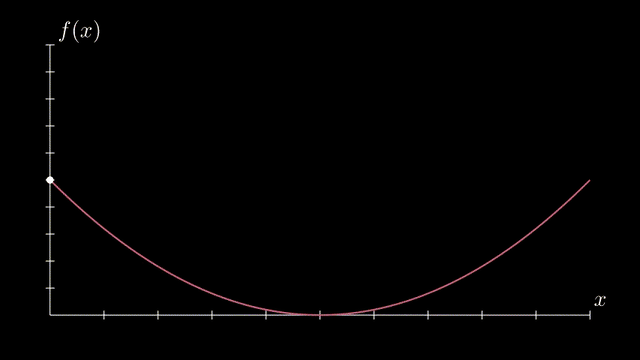
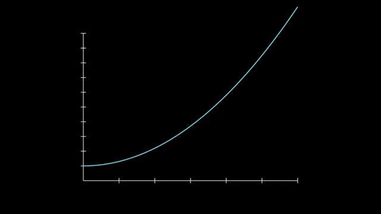
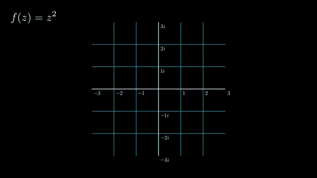

# 5. 좌표계와 그래프

예제 원본: [`scenes/ch05_plotting.py`](scenes/ch05_plotting.py)

## 핵심 개념

`Axes` 같은 좌표계는 자기만의 수학 좌표를 가지고, 화면 좌표와는 단위와 원점이 다릅니다. 그래서 좌표계 위에 뭔가를 그릴 때는 항상 좌표계의 변환 메서드를 거칩니다. 그래프, 넓이, 할선 같은 것은 좌표계 객체의 메서드로 만듭니다.

| 변환 | 뜻 |
|---|---|
| `ax.c2p(x, y)` | 수학 좌표를 화면 좌표로 (coords to point, 가장 많이 씀) |
| `ax.p2c(point)` | 화면 좌표를 수학 좌표로 |
| `ax.i2gp(x, graph)` | x에서의 그래프 위 점 (input to graph point) |

- `ax.plot(함수, x_range=, color=)`: 함수 그래프
- `ax.plot_parametric_curve(함수, t_range=)`: 매개변수 곡선
- `ax.get_axis_labels()`: x, y 축 이름
- `ax.get_graph_label(graph, "tex", x_val=, direction=)`: 그래프 옆 라벨
- `ax.get_vertical_line(점)`: 점에서 x축까지 수직선
- `ax.get_area(graph, x_range=)`: 곡선 아래 넓이
- `ax.get_riemann_rectangles(graph, x_range=, dx=)`: 리만 합 직사각형
- `ax.get_secant_slope_group(x=, graph=, dx=)`: 할선과 dx, dy 표시
- 좌표계 종류: `Axes`, `NumberPlane`(격자), `PolarPlane`, `ComplexPlane`, `ThreeDAxes`, `NumberLine`

## SinAndCos: 그래프 그리기 (공식 예제 변형)

좌표계를 만들고 그 위에 사인, 코사인 그래프와 라벨을 그리는 예제입니다. 그래프에 넘기는 함수는 숫자 하나를 받아 숫자 하나를 돌려주면 되므로 numpy 함수를 그대로 쓸 수 있습니다.

- `Axes(x_range=[최소, 최대, 눈금간격], y_range=, x_length=)`: 좌표계 생성
  - `x_length`: 화면에서의 길이
- `axes.plot(np.sin, color=BLUE)`: 사인 그래프
- `axes.get_graph_label(...)`: 그래프 라벨
- `axes.get_vertical_line(...)`: 수직선


```exercise
id: ch05-sincos
title: sin과 cos 그래프
scene: ch05_plotting.py SinAndCos
gif: SinAndCos
hint: 좌표계는 Axes, 함수 그래프는 axes.plot(함수), 라벨은 get_graph_label.
---
from manim import *


class SinAndCos(Scene):
    """Axes + plot + 라벨 + 특정 점 표시. (공식 예제 SinAndCosFunctionPlot 변형)"""

    def construct(self):
        axes = ⟦Axes⟧(  # 좌표계 생성
            x_range=[-10, 10.3, 1],
            y_range=[-1.5, 1.5, 1],
            x_length=10,
            axis_config={"color": GREEN},
            x_axis_config={"numbers_to_include": np.arange(-10, 10.01, 2)},
            tips=False,
        )
        axes_labels = axes.get_axis_labels()

        sin_graph = axes.⟦plot⟧(np.⟦sin⟧, color=BLUE)  # 사인 그래프
        cos_graph = axes.plot(np.cos, color=RED)
        sin_label = axes.get_graph_label(sin_graph, r"\sin(x)", x_val=-10, direction=UP / 2)
        cos_label = axes.⟦get_graph_label⟧(cos_graph, label=r"\cos(x)")  # 코사인 그래프에 라벨

        vert_line = axes.⟦get_vertical_line⟧(axes.i2gp(TAU, cos_graph), color=YELLOW, line_func=Line)  # x = 2π 위치에서 x축까지 수직선
        line_label = axes.get_graph_label(cos_graph, r"x=2\pi", x_val=TAU, direction=UR, color=WHITE)

        self.play(Create(axes), Write(axes_labels))
        self.play(Create(sin_graph), FadeIn(sin_label))
        self.play(Create(cos_graph), FadeIn(cos_label))
        self.play(Create(vert_line), Write(line_label))
        self.wait()
```

## RiemannToArea: 리만 합에서 적분으로

곡선 아래를 직사각형으로 채운 뒤, 직사각형 폭을 점점 줄이다가 마지막에 매끄러운 넓이로 바꾸는 예제입니다. 폭이 다른 직사각형 묶음을 새로 만들어 기존 것과 바꿔 끼우는 방식으로 애니메이션합니다.

- `get_riemann_rectangles(curve, x_range=, dx=0.5)`: 폭 0.5짜리 직사각형들
- `Transform(기존, 새것)`: 더 가는 직사각형으로 바꿔 끼움
- `get_area(curve, x_range=)`: 매끄러운 넓이
- `FadeTransform(a, b)`: 겹쳐서 사라지고 나타나며 변형
  - 모양이 많이 다른 두 객체 사이에 어울림


```exercise
id: ch05-area
title: 리만 합에서 넓이로
scene: ch05_plotting.py RiemannToArea
gif: RiemannToArea
hint: 직사각형은 get_riemann_rectangles(graph, dx=...), 넓이는 get_area(graph, x_range=...).
---
from manim import *


class RiemannToArea(Scene):
    """리만 합의 직사각형이 점점 가늘어져 넓이가 된다."""

    def construct(self):
        ax = Axes(x_range=[0, 5], y_range=[0, 6], x_length=7, y_length=5, tips=False).add_coordinates()
        curve = ax.plot(lambda x: 0.25 * (x - 1) ** 3 - 0.8 * (x - 1) + 2.5, x_range=[0, 4.5], color=YELLOW)
        self.play(Create(ax), Create(curve))

        rects = ax.⟦get_riemann_rectangles⟧(curve, x_range=[0.5, 4], dx=0.5, fill_opacity=0.6)  # 폭 0.5짜리 직사각형들
        self.play(Create(rects))
        for dx in [0.25, 0.1, 0.05]:
            new = ax.get_riemann_rectangles(curve, x_range=[0.5, 4], dx=dx, fill_opacity=0.6)
            self.play(⟦Transform⟧(rects, new), run_time=0.8)  # 더 가는 직사각형으로 바꿔 끼우기

        area = ax.⟦get_area⟧(curve, x_range=[0.5, 4], color=(BLUE, GREEN), opacity=0.6)  # 곡선 아래 넓이
        integral = MathTex(r"\int_{0.5}^{4} f(x)\,dx").to_corner(UR)
        self.play(⟦FadeTransform⟧(rects, area), Write(integral))  # 직사각형을 넓이로 바꾸며 적분 기호 쓰기
        self.wait()
```

## ArgMin: 최솟값까지 굴러가기 (공식 예제)

점의 x 좌표를 `ValueTracker`로 두고, 점이 항상 곡선 위에 있도록 updater를 붙입니다. 트래커를 최솟값 위치까지 움직이면 점이 곡선을 타고 내려갑니다.

- `ax.c2p(x, f(x))`: 곡선 위 점의 화면 좌표
- `dot.add_updater(lambda x: x.move_to(...))`: 점이 트래커를 따라감
- `np.linspace(시작, 끝, 개수)`: x를 촘촘하게 생성
- `f(x들).argmin()`: 가장 작은 값의 인덱스



```exercise
id: ch05-argmin
title: 최솟값까지 점 굴리기
scene: ch05_plotting.py ArgMin
gif: ArgMin
hint: 수학 좌표 → 화면 좌표 변환은 c2p(x, y). 가장 작은 값의 위치는 numpy의 argmin.
---
from manim import *


class ArgMin(Scene):
    """ValueTracker 로 점을 곡선 위 최솟값까지 굴린다. (공식 예제 ArgMinExample)"""

    def construct(self):
        ax = Axes(x_range=[0, 10], y_range=[0, 100, 10], axis_config={"include_tip": False})
        labels = ax.get_axis_labels(x_label="x", y_label="f(x)")

        t = ValueTracker(0)

        def func(x):
            return 2 * (x - 5) ** 2

        graph = ax.plot(func, color=MAROON)

        dot = Dot(point=ax.⟦c2p⟧(t.get_value(), func(t.get_value())))  # 수학 좌표 (x, f(x))를 화면 좌표로
        dot.⟦add_updater⟧(lambda x: x.⟦move_to⟧(ax.c2p(t.get_value(), func(t.get_value()))))  # 매 프레임 점을 곡선 위 현재 위치로 이동

        x_space = np.linspace(*ax.x_range[:2], 200)
        minimum_index = func(x_space).⟦argmin⟧()  # 가장 작은 값의 인덱스

        self.add(ax, labels, graph, dot)
        self.play(t.animate.set_value(x_space[minimum_index]), run_time=2)
        self.wait()
```

## DerivativeSecant: 할선이 접선이 되기까지

미분의 정의인 "dx → 0"을 그대로 애니메이션으로 만듭니다. dx를 `ValueTracker`로 두고 할선을 매 프레임 다시 그리면, dx가 줄어들면서 할선이 접선에 다가가는 모습이 보입니다.

- `ValueTracker(2.5)`: dx의 시작값
- `always_redraw(lambda: ax.get_secant_slope_group(...))`: 할선 묶음을 매 프레임 새로 생성
  - dx 인자에 `dx.get_value()`를 넣음
- `dx.animate.set_value(0.01)`: dx를 0에 가깝게



```exercise
id: ch05-secant
title: 할선이 접선이 되기까지
scene: ch05_plotting.py DerivativeSecant
gif: DerivativeSecant
hint: 할선 묶음은 get_secant_slope_group(x=, graph=, dx=). dx가 바뀔 때마다 새로 그려야 하니 always_redraw.
---
from manim import *


class DerivativeSecant(Scene):
    """할선이 접선으로: dx → 0 을 ValueTracker 로 표현."""

    def construct(self):
        ax = Axes(x_range=[0, 6], y_range=[0, 10], x_length=8, y_length=5.5, tips=False)
        graph = ax.plot(lambda x: 0.3 * x**2 + 1, color=BLUE)
        dx = ⟦ValueTracker⟧(2.5)  # dx 값 (시작 2.5)

        secant = ⟦always_redraw⟧(  # 할선을 매 프레임 새로 생성
            lambda: ax.⟦get_secant_slope_group⟧(  # 할선과 dx, dy 표시 묶음
                x=1.5, graph=graph, dx=dx.⟦get_value⟧(),  # dx 인자에 트래커의 현재 값
                dx_label="dx", dy_label="dy", secant_line_length=6, secant_line_color=RED,
            )
        )
        dx_value = always_redraw(
            lambda: MathTex(f"dx = {dx.get_value():.2f}").to_corner(UL)
        )
        self.add(ax, graph)
        self.play(Create(secant), Write(dx_value))
        self.play(dx.animate.⟦set_value⟧(0.01), run_time=4)  # dx를 0에 가깝게
        self.wait()
```

## ComplexMap: 평면 전체를 함수로 변형

복소평면의 모든 점에 복소함수를 적용해서 격자 전체가 휘는 모습을 보여 줍니다. 직선으로 된 격자는 점이 적어서 그대로 휘면 각지게 보이므로, 먼저 선을 잘게 쪼개 둡니다.

- `ComplexPlane()`: 복소평면
  - `.add_coordinates()`: 눈금 숫자
- `prepare_for_nonlinear_transform()`: 선을 잘게 쪼개서 매끄럽게 휘도록 준비
- `plane.animate.apply_complex_function(lambda z: ...)`: 모든 점에 복소함수 적용
  - 예제는 화면에 들어오도록 z²을 3으로 나눔
- `apply_function(lambda p: ...)`: 복소수가 아닌 일반 2D 변환
  - 9장 OpeningManim에서 사용



```exercise
id: ch05-complex
title: 평면에 z² 적용하기
scene: ch05_plotting.py ComplexMap
gif: ComplexMap
hint: 휘어지기 전에 prepare_for_nonlinear_transform()을 호출하고, 복소함수는 apply_complex_function.
---
from manim import *


class ComplexMap(Scene):
    """ComplexPlane 에 f(z) = z² 적용."""

    def construct(self):
        plane = ⟦ComplexPlane⟧(x_range=[-3, 3], y_range=[-3, 3]).add_coordinates()  # 복소평면 생성
        title = MathTex("f(z) = z^2").to_corner(UL).add_background_rectangle()
        self.add(plane, title)
        self.wait(0.5)

        plane.⟦prepare_for_nonlinear_transform⟧()  # 선을 잘게 쪼개서 매끄럽게 휘도록 준비
        self.play(plane.animate.⟦apply_complex_function⟧(lambda z: z**⟦2⟧ / 3), run_time=3)  # 모든 점에 z²/3 적용
        self.wait()
```

## ✍️ 직접 해보기

1. `SinAndCos`에 `tan(x)`를 추가해 보세요. 불연속점은 `discontinuities=[...]`와 `use_smoothing=False` 옵션으로 처리합니다.
2. `RiemannToArea`에서 `input_sample_type="right"`와 `"center"`를 비교해 보세요.
3. `ArgMin`을 경사하강법으로 바꿔 보세요. 점이 한 번에 가지 말고 `x -= lr * f'(x)` 단계마다 이동하게 만듭니다.
4. `ComplexMap`에서 `z**2` 대신 `np.exp(z)`나 `1/z`를 적용해 보세요.
