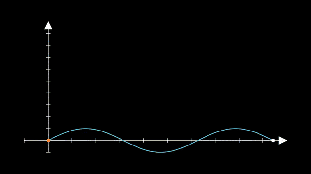

# 6. 카메라

예제 원본: [`scenes/ch06_camera.py`](scenes/ch06_camera.py)

## 핵심 개념

기본 `Scene`의 카메라는 고정되어 있어서, 카메라를 움직이려면 상속하는 Scene 클래스를 바꿔야 합니다. 카메라가 보는 영역은 `frame`이라는 사각형 Mobject라서, 다른 객체처럼 `.animate`, `save_state()`, `Restore()`, updater를 모두 쓸 수 있습니다.

| Scene | 카메라 | 조작 |
|---|---|---|
| `MovingCameraScene` | 2D 이동과 줌 | `self.camera.frame` |
| `ZoomedScene` | 돋보기 창 추가 | `self.zoomed_camera.frame`, `self.activate_zooming()` |
| `ThreeDScene` | 3D 궤도 | `set_camera_orientation`, `move_camera` (7장) |

- `frame.animate.scale(0.5)`: frame을 작게 만들면 줌인, 크게 만들면 줌아웃
- `frame.animate.move_to(...)`: 카메라가 그쪽을 봄

## FollowingGraphCamera: 점 따라가기 (공식 예제)

카메라가 그래프 위를 달리는 점을 따라가는 예제입니다. frame에 "매 프레임 점 위치로 이동"하는 updater를 붙이면 카메라가 점을 추적하고, 끝나면 저장해 둔 원래 화면으로 돌아옵니다.

- `self.camera.frame.save_state()`: 원래 카메라 상태 저장
- `frame.animate.scale(0.5).move_to(점)`: 절반 크기로 줌인하며 점으로 이동
- `frame.add_updater(...)`: 매 프레임 점 위치로 이동
- `MoveAlongPath(점, 경로)`: 경로를 따라 이동
- `Restore(frame)`: 원래 화면으로 복귀



```exercise
id: ch06-follow
title: 카메라로 점 따라가기
scene: ch06_camera.py FollowingGraphCamera
gif: FollowingGraphCamera
hint: 카메라를 움직이려면 MovingCameraScene. 카메라 사각형은 self.camera.frame.
---
from manim import *


class FollowingGraphCamera(⟦MovingCameraScene⟧):  # 카메라를 움직일 수 있는 Scene
    """카메라가 그래프 위를 달리는 점을 따라간다. (공식 예제)"""

    def construct(self):
        self.camera.⟦frame⟧.⟦save_state⟧()  # 원래 카메라 상태 저장

        ax = Axes(x_range=[-1, 10], y_range=[-1, 10])
        graph = ax.plot(lambda x: np.sin(x), color=BLUE, x_range=[0, 3 * PI])

        moving_dot = Dot(ax.i2gp(graph.t_min, graph), color=ORANGE)
        dot_1 = Dot(ax.i2gp(graph.t_min, graph))
        dot_2 = Dot(ax.i2gp(graph.t_max, graph))

        self.add(ax, graph, dot_1, dot_2, moving_dot)
        self.play(self.camera.frame.animate.scale(0.5).move_to(moving_dot))

        def update_curve(mob):
            mob.move_to(moving_dot.get_center())

        self.camera.frame.add_updater(update_curve)
        self.play(⟦MoveAlongPath⟧(moving_dot, graph, rate_func=linear), run_time=4)  # 점을 그래프를 따라 이동
        self.camera.frame.remove_updater(update_curve)

        self.play(⟦Restore⟧(self.camera.frame))  # 원래 카메라 상태로 복귀
```

## ZoomIntoDetail: 프랙탈 속으로 줌인

재귀 함수로 시에르핀스키 삼각형을 만들고, 카메라를 모서리로 10배 줌인했다가 빠져나오는 예제입니다. 줌인 전에 상태를 저장해 두면 나올 때 한 줄로 되돌릴 수 있습니다.

- `t.get_vertices()`: 삼각형의 꼭짓점 좌표
- `frame.save_state()`: 줌인 전 상태 저장
- `frame.animate.scale(0.1)`: 10배 줌인
- `Restore(frame)`: 원래 화면으로 복귀


```exercise
id: ch06-fractal
title: 프랙탈 속으로 줌인하기
scene: ch06_camera.py ZoomIntoDetail
gif: ZoomIntoDetail
hint: 줌인은 frame을 작게(scale 0.1) 만드는 것입니다. 되돌리려면 먼저 save_state, 나중에 Restore.
---
from manim import *


class ZoomIntoDetail(⟦MovingCameraScene⟧):  # 카메라를 움직일 수 있는 Scene
    """프랙탈처럼 작은 디테일로 줌인했다가 빠져나오기."""

    def construct(self):
        tri = Triangle().scale(3.2)

        def sierpinski(t, depth):
            if depth == 0:
                return VGroup(t)
            v = t.⟦get_vertices⟧()  # 삼각형의 꼭짓점 좌표
            subs = [Polygon(v[i], (v[i] + v[(i + 1) % 3]) / 2, (v[i] + v[(i + 2) % 3]) / 2) for i in range(3)]
            return VGroup(*[sierpinski(s, depth - 1) for s in subs])

        fractal = sierpinski(tri, 5).set_stroke(width=1).set_fill(opacity=0.8)
        fractal.set_color_by_gradient(BLUE, PURPLE, PINK)
        self.play(Create(fractal, lag_ratio=0.01), run_time=2)

        frame = self.camera.frame
        frame.⟦save_state⟧()  # 줌인 전 카메라 상태 저장
        target = tri.get_vertices()[1]
        self.play(frame.animate.⟦scale⟧(0.1).move_to(target + UR * 0.08), run_time=3)  # 카메라 frame을 10배 줄여 줌인
        self.wait(0.5)
        self.play(⟦Restore⟧(frame), run_time=2)  # 원래 화면으로 복귀
        self.wait(0.5)
```

## MagnifyingGlass: 돋보기 창

화면 일부를 확대해서 별도의 창에 보여 주는 예제입니다. 확대할 영역을 나타내는 작은 사각형과, 확대된 화면을 띄우는 창이 따로 있습니다. 작은 사각형을 움직이면 창의 내용도 따라 바뀝니다.

- `ZoomedScene`: 돋보기 기능이 있는 Scene
  - 설정은 `__init__`에서 `super().__init__(zoom_factor=..., ...)`로 넘김
- `self.zoomed_camera.frame`: 확대할 영역
- `self.zoomed_display`: 확대된 화면이 뜨는 창
- `self.activate_zooming(animate=True)`: 돋보기 켜기


```exercise
id: ch06-zoom
title: 돋보기 창 띄우기
scene: ch06_camera.py MagnifyingGlass
gif: MagnifyingGlass
hint: 돋보기용 Scene은 ZoomedScene, 켜는 메서드는 activate_zooming.
---
from manim import *


class MagnifyingGlass(⟦ZoomedScene⟧):  # 돋보기 창이 있는 Scene
    """ZoomedScene: 화면 일부를 돋보기 창으로 보여준다."""

    def __init__(self, **kwargs):
        super().__init__(
            zoom_factor=0.25,
            zoomed_display_height=3,
            zoomed_display_width=4,
            image_frame_stroke_width=3,
            zoomed_camera_config={"default_frame_stroke_width": 3},
            **kwargs,
        )

    def construct(self):
        text = Text("tiny details are hidden here", font_size=14).move_to(LEFT * 3 + DOWN)
        dots = VGroup(*[Dot(radius=0.02, color=random_bright_color()) for _ in range(40)])
        for d in dots:
            d.move_to(LEFT * 3 + DOWN + np.random.uniform(-1, 1, 3) * [1.3, 0.6, 0])
        self.add(text, dots)

        frame = self.⟦zoomed_camera⟧.frame  # 확대할 영역을 나타내는 사각형
        frame.move_to(text.get_left() + RIGHT * 0.3).set_color(YELLOW)
        self.zoomed_display.display_frame.set_color(YELLOW)
        self.zoomed_display.to_corner(UR)

        self.⟦activate_zooming⟧(animate=True)  # 돋보기 켜기
        self.play(frame.animate.move_to(text.get_right() + LEFT * 0.3), run_time=3)
        self.play(frame.animate.scale(0.5), run_time=1)
        self.wait(0.5)
```

## ✍️ 직접 해보기

1. `FollowingGraphCamera`에서 카메라가 점을 따라가는 동안 점점 더 줌인되도록 바꿔 보세요. updater 안에서 `f.scale(...)`를 쓰면 매 프레임 누적되니, `set_width`로 절대 크기를 지정하는 게 안전합니다.
2. 긴 수식을 화면에 띄워 두고, 카메라가 항 하나하나를 차례로 줌인하며 설명하는 장면을 만들어 보세요.
