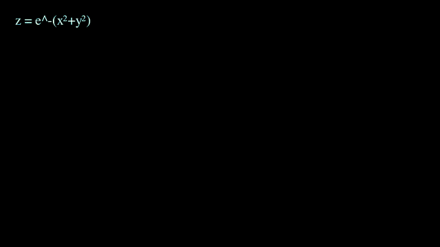
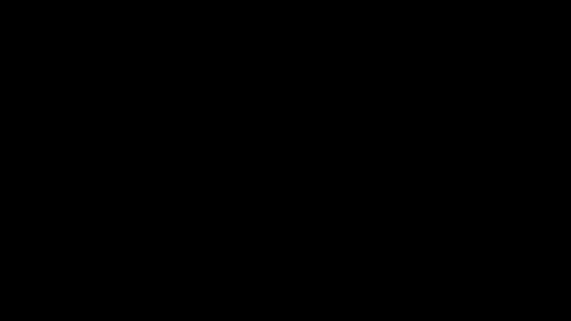

# 7. 3D

예제 원본: [`scenes/ch07_3d.py`](scenes/ch07_3d.py)

## 핵심 개념

3D 장면은 `ThreeDScene`을 상속하고, 카메라 방향을 구면좌표의 두 각도로 지정합니다. phi는 z축에서 기운 각도로 0이면 바로 위에서 내려다보고 90°면 옆에서 봅니다. theta는 수평 회전각입니다.

- `self.set_camera_orientation(phi=, theta=)`: 카메라 방향을 즉시 설정
- `self.move_camera(phi=, theta=, run_time=)`: 카메라를 애니메이션으로 이동
- `self.begin_ambient_camera_rotation(rate=)`: 카메라가 계속 천천히 돌기 시작
- `self.stop_ambient_camera_rotation()`: 회전 멈춤
- `self.add_fixed_in_frame_mobjects(mob)`: 카메라가 돌아도 화면에 고정
  - 제목이나 수식에 사용

## GaussianSurface: 곡면과 카메라 회전

3D 좌표축 위에 가우스 곡면을 그리고 카메라를 돌려 보는 예제입니다. 곡면은 `(u, v)` 두 매개변수를 받아 3D 점을 돌려주는 함수로 정의하고, 높이에 따라 색을 입힙니다.

- `Surface(함수, u_range=, v_range=, resolution=)`: 곡면 생성
  - 함수는 `(u, v)`를 받아 3D 점을 돌려줌. 좌표축에 맞추려면 `axes.c2p(u, v, z)`를 돌려줌
  - `resolution`을 올리면 매끄럽지만 느려짐. 작업 중 16~24, 최종본 32~64
- `set_fill_by_value(axes=, colorscale=, axis=2)`: 높이(z)에 따라 색칠



```exercise
id: ch07-surface
title: 가우스 곡면과 카메라 회전
scene: ch07_3d.py GaussianSurface
gif: GaussianSurface
hint: 3D는 ThreeDScene. 카메라 각도는 set_camera_orientation(phi=, theta=), 화면 고정은 add_fixed_in_frame_mobjects.
---
from manim import *


class GaussianSurface(⟦ThreeDScene⟧):  # 3D 장면
    """ThreeDAxes + Surface + 카메라 회전."""

    def construct(self):
        axes = ThreeDAxes(x_range=[-3, 3], y_range=[-3, 3], z_range=[0, 2], x_length=6, y_length=6, z_length=3)

        def gauss(u, v):
            return axes.c2p(u, v, 1.6 * np.exp(-(u**2 + v**2) / 1.5))

        surface = ⟦Surface⟧(gauss, u_range=[-3, 3], v_range=[-3, 3], resolution=(24, 24))  # (u, v)로 정의한 곡면
        surface.set_style(fill_opacity=0.8)
        surface.set_fill_by_value(axes=axes, colorscale=[(BLUE, 0), (GREEN, 0.8), (YELLOW, 1.6)], axis=2)

        # phi: 위에서 내려다보는 각, theta: 수평 회전각
        self.⟦set_camera_orientation⟧(phi=70 * DEGREES, theta=-45 * DEGREES)  # 카메라 각도 설정

        title = Text("z = e^-(x²+y²)", font_size=32).to_corner(UL)
        self.⟦add_fixed_in_frame_mobjects⟧(title)  # 카메라가 돌아도 제목은 화면에 고정

        self.play(Create(axes))
        self.play(Create(surface), run_time=2)
        self.⟦begin_ambient_camera_rotation⟧(rate=0.4)  # 카메라가 천천히 계속 회전
        self.wait(3)
        self.stop_ambient_camera_rotation()
        self.move_camera(phi=20 * DEGREES, run_time=1.5)  # 위에서 보기
        self.wait(0.5)
```

## Solids: 기본 입체

기본 입체 도형을 늘어놓고 돌린 뒤 카메라 각도를 바꿔 보는 예제입니다. 입체 도형도 2D 도형처럼 클래스 이름으로 만들고 색과 크기를 인자로 넘깁니다.

- `Sphere(radius=)`: 구
- `Cube(side_length=)`: 정육면체
- `Prism`, `Cone`, `Cylinder`, `Torus`: 각기둥, 원뿔, 원기둥, 도넛
- `Tetrahedron`, `Octahedron`, `Icosahedron`, `Dodecahedron`: 정다면체
- `Dot3D`, `Line3D`, `Arrow3D`: 3D용 점, 선, 화살표
- `Rotate(mob, angle=, axis=)`: 회전축을 중심으로 회전
  - `axis=UP`이면 세로축 중심
- `self.move_camera(theta=)`: 다른 각도로 카메라 이동



```exercise
id: ch07-solids
title: 입체 도형 늘어놓고 돌리기
scene: ch07_3d.py Solids
gif: Solids
hint: 구는 Sphere, 정육면체는 Cube. 카메라를 애니메이션으로 옮기는 메서드는 move_camera.
---
from manim import *


class Solids(ThreeDScene):
    """기본 입체 도형들."""

    def construct(self):
        self.set_camera_orientation(phi=65 * DEGREES, theta=30 * DEGREES)
        solids = [
            ⟦Sphere⟧(radius=0.8, resolution=(16, 16)).set_color(BLUE),  # 구
            ⟦Cube⟧(side_length=1.3, fill_color=RED, fill_opacity=0.8),  # 정육면체
            Cone(base_radius=0.7, height=1.5).set_color(GREEN),
            Torus(major_radius=0.7, minor_radius=0.25, resolution=(16, 16)).set_color(ORANGE),
            Dodecahedron().scale(0.6).set_color(PURPLE),
        ]
        positions = [LEFT * 4, LEFT * 2, ORIGIN, RIGHT * 2, RIGHT * 4]
        for s, p in zip(solids, positions):
            s.move_to(p)

        self.play(LaggedStart(*[FadeIn(s, scale=0.5) for s in solids], lag_ratio=0.2))
        self.play(*[⟦Rotate⟧(s, angle=PI, ⟦axis⟧=UP) for s in solids], run_time=2)  # 세로축을 중심으로 반 바퀴 회전
        self.⟦move_camera⟧(theta=120 * DEGREES, run_time=2)  # 카메라를 다른 각도로 이동
        self.wait(0.5)
```

## ⚠️ 3D는 느립니다

기본 Cairo 렌더러는 3D를 CPU로 그리기 때문에 2D보다 훨씬 느립니다.

- 작업 중에는 `-ql`과 낮은 `resolution` 사용
- `--renderer=opengl`: 빠르고 실시간 미리보기 창도 뜸
  - 일부 기능은 호환되지 않을 수 있음

## ✍️ 직접 해보기

1. `GaussianSurface`의 함수를 안장면 `z = x² - y²`로 바꿔 보세요.
2. `ThreeDAxes.plot_parametric_curve`로 나선 `(cos t, sin t, t/5)`를 그리고 카메라를 돌려 보세요.
3. `Cube`를 `Rotate(axis=...)`로 세 축에 대해 차례로 돌리면서, 축 이름을 `add_fixed_in_frame_mobjects`로 표시해 보세요.
