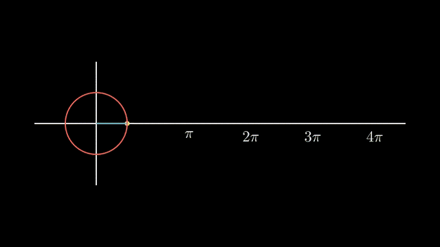
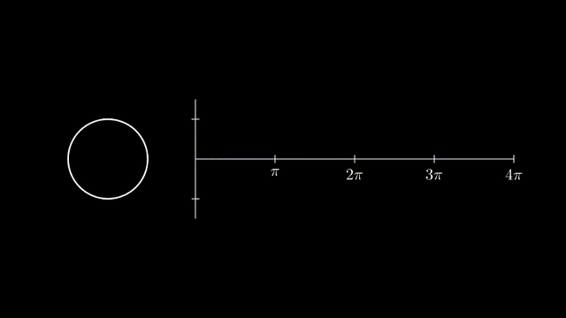

# 9. 고급 프로젝트 (공식 예제)

예제 원본: [`scenes/ch09_advanced.py`](scenes/ch09_advanced.py)
출처: https://docs.manim.community/en/stable/examples.html#advanced-projects

## 핵심 개념

공식 갤러리의 Advanced Projects에 있는 두 예제와, 그중 하나를 다시 짠 버전입니다. 새로운 기능보다는 1~5장에서 배운 것을 조합해서 한 편의 장면을 만드는 방법을 봅니다.

## OpeningManim

수식 등장, 제목 변형, 격자 생성, 격자 전체의 비선형 변환을 이어서 보여 주는 예제입니다. 아래 표처럼 대부분 앞에서 배운 기능이고, 새로운 점은 그리는 순서(z-order)입니다.

| 이 예제에 나오는 것 | 배운 곳 |
|---|---|
| 제목과 수식을 세로로 정렬 (`arrange(DOWN)`) | 1장: 배치 |
| `Write`와 `FadeIn(shift=DOWN)`을 한 `play`에 | 2장: 동시 재생 |
| 수식의 조각마다 차례로 `FadeOut` (`LaggedStart`) | 2장: 조합 |
| `Create(grid, run_time=3, lag_ratio=0.1)` | 2장: `lag_ratio`로 격자선이 차례로 그려짐 |
| 격자는 `NumberPlane()` | 5장: 좌표계 |
| `prepare_for_nonlinear_transform()` → `grid.animate.apply_function(함수)` | 5장: 비선형 변환 |

- `self.add(a, b)`: 나중에 add한 b가 위에 그려짐
  - 예: `self.add(grid, grid_title)` → 제목이 격자 위에 표시


```exercise
id: ch09-opening
title: OpeningManim 완성하기
scene: ch09_advanced.py OpeningManim
gif: OpeningManim
hint: 수식을 조각별로 차례로 내보낼 땐 LaggedStart, 격자는 NumberPlane, 비선형 변환 전엔 prepare_for_nonlinear_transform.
---
from manim import *


class OpeningManim(Scene):
    """공식 예제 그대로: Tex/MathTex → Transform → NumberPlane → 비선형 변환."""

    def construct(self):
        title = Tex(r"This is some \LaTeX")
        basel = MathTex(r"\sum_{n=1}^\infty \frac{1}{n^2} = \frac{\pi^2}{6}")
        VGroup(title, basel).⟦arrange⟧(DOWN)  # 제목과 수식을 세로로 정렬
        self.play(
            Write(title),
            FadeIn(basel, shift=DOWN),
        )
        self.wait()

        transform_title = Tex("That was a transform")
        transform_title.to_corner(UP + LEFT)
        self.play(
            Transform(title, transform_title),
            ⟦LaggedStart⟧(*[FadeOut(obj, shift=DOWN) for obj in basel]),  # 수식 조각을 차례로 퇴장
        )
        self.wait()

        grid = ⟦NumberPlane⟧()  # 좌표 격자
        grid_title = Tex("This is a grid", font_size=72)
        grid_title.move_to(transform_title)

        self.add(grid, grid_title)  # Make sure title is on top of grid
        self.play(
            FadeOut(title),
            FadeIn(grid_title, shift=UP),
            Create(grid, run_time=3, lag_ratio=0.1),
        )
        self.wait()

        grid_transform_title = Tex(r"That was a non-linear function \\ applied to the grid")
        grid_transform_title.move_to(grid_title, UL)
        grid.⟦prepare_for_nonlinear_transform⟧()  # 선을 잘게 쪼개서 매끄럽게 휘도록 준비
        self.play(
            grid.animate.⟦apply_function⟧(  # 격자의 모든 점에 함수 적용
                lambda p: p
                + np.array(
                    [
                        np.sin(p[1]),
                        np.sin(p[0]),
                        0,
                    ]
                )
            ),
            run_time=3,
        )
        self.wait()
        self.play(Transform(grid_title, grid_transform_title))
        self.wait()
```

## SineCurveUnitCircle

한국 개발자 heejin_park이 기여한 예제입니다. 단위원 위의 점이 돌면서 오른쪽에 사인 곡선을 그립니다. 점은 `dt` updater로 돌리고, 선 세 개(중심에서 점까지, 점에서 곡선 끝까지, 곡선 자체)는 `always_redraw`로 매 프레임 다시 그립니다. 곡선은 매 프레임 짧은 `Line`을 하나씩 이어 붙여서 만듭니다.

- `orbit.point_from_proportion(비율)`: 원 둘레 위의 위치
  - 비율은 0~1. 예: `0.25`는 둘레의 1/4 지점
- `go_around_circle(mob, dt)`: `self.t_offset`에 `dt * rate`를 누적해서 점을 옮기는 함수
- `dot.add_updater(함수)`: 점에 updater 붙이기
- `always_redraw(함수)`: 선 세 개를 매 프레임 새로 생성
- `self.wait(8.5)`: 이 동안 updater가 동작
- `dot.remove_updater(함수)`: 끝나면 updater 떼기



```exercise
id: ch09-unitcircle
title: SineCurveUnitCircle 완성하기
scene: ch09_advanced.py SineCurveUnitCircle
gif: SineCurveUnitCircle
hint: 원 위의 위치는 point_from_proportion(0~1). dt를 받는 함수는 add_updater로 붙이고, 매 프레임 새로 만드는 선은 always_redraw.
---
from manim import *


class SineCurveUnitCircle(Scene):
    """공식 예제 그대로: 단위원 위의 점이 사인 곡선을 그린다.

    contributed by heejin_park, https://infograph.tistory.com/230
    """

    def construct(self):
        self.show_axis()
        self.show_circle()
        self.move_dot_and_draw_curve()
        self.wait()

    def show_axis(self):
        x_start = np.array([-6, 0, 0])
        x_end = np.array([6, 0, 0])

        y_start = np.array([-4, -2, 0])
        y_end = np.array([-4, 2, 0])

        x_axis = Line(x_start, x_end)
        y_axis = Line(y_start, y_end)

        self.add(x_axis, y_axis)
        self.add_x_labels()

        self.origin_point = np.array([-4, 0, 0])
        self.curve_start = np.array([-3, 0, 0])

    def add_x_labels(self):
        x_labels = [
            MathTex(r"\pi"),
            MathTex(r"2 \pi"),
            MathTex(r"3 \pi"),
            MathTex(r"4 \pi"),
        ]

        for i in range(len(x_labels)):
            x_labels[i].next_to(np.array([-1 + 2 * i, 0, 0]), DOWN)
            self.add(x_labels[i])

    def show_circle(self):
        circle = Circle(radius=1)
        circle.move_to(self.origin_point)
        self.add(circle)
        self.circle = circle

    def move_dot_and_draw_curve(self):
        orbit = self.circle
        origin_point = self.origin_point

        dot = Dot(radius=0.08, color=YELLOW)
        dot.move_to(orbit.⟦point_from_proportion⟧(0))  # 원 둘레의 시작 위치로 점 이동
        self.t_offset = 0
        rate = 0.25

        def go_around_circle(mob, dt):
            self.t_offset += ⟦dt⟧ * rate  # 프레임 간 시간만큼 진행도 누적
            mob.move_to(orbit.point_from_proportion(self.t_offset % 1))

        def get_line_to_circle():
            return Line(origin_point, dot.get_center(), color=BLUE)

        def get_line_to_curve():
            x = self.curve_start[0] + self.t_offset * 4
            y = dot.get_center()[1]
            return Line(dot.get_center(), np.array([x, y, 0]), color=YELLOW_A, stroke_width=2)

        self.curve = VGroup()
        self.curve.add(Line(self.curve_start, self.curve_start))

        def get_curve():
            last_line = self.curve[-1]
            x = self.curve_start[0] + self.t_offset * 4
            y = dot.get_center()[1]
            new_line = Line(last_line.get_end(), np.array([x, y, 0]), color=YELLOW_D)
            self.curve.add(new_line)

            return self.curve

        dot.⟦add_updater⟧(go_around_circle)  # 점에 회전 함수 붙이기

        origin_to_circle_line = ⟦always_redraw⟧(get_line_to_circle)  # 중심에서 점까지 선을 매 프레임 새로 생성
        dot_to_curve_line = always_redraw(get_line_to_curve)
        sine_curve_line = always_redraw(get_curve)

        self.add(dot)
        self.add(orbit, origin_to_circle_line, dot_to_curve_line, sine_curve_line)
        self.wait(8.5)

        dot.⟦remove_updater⟧(go_around_circle)  # 회전 멈추기
```

## SineCurveTracker: 다시 짠 버전

같은 장면을 4장과 5장의 도구로 다시 짠 버전입니다. 모든 움직임을 `ValueTracker` 하나(θ)가 구동하기 때문에 시간을 자유롭게 다룰 수 있습니다. `theta.animate.set_value(PI)`로 중간에 멈추거나 되감을 수 있고, `rate_func`도 바꿀 수 있습니다.

| | 원본 | 다시 짠 버전 |
|---|---|---|
| 시간 | `self.t_offset += dt * rate` (Scene 속성에 직접 누적) | `theta = ValueTracker(0)` 하나 |
| 재생 | `self.wait(8.5)` 후 updater 제거 | `self.play(theta.animate.set_value(4*PI), rate_func=linear)` |
| 곡선 | `Line`을 매 프레임 추가 (프레임 수만큼 객체가 쌓임) | `axes.plot(np.sin, x_range=[0, θ])`로 매 프레임 다시 그림 |
| 좌표 | `np.array([-4,0,0])` 하드코딩 | `axes.c2p(θ, sin θ)` |
| 확장 | 코사인 추가가 번거로움 | `axes.plot(np.cos, ...)` 한 줄 |

- `4 * PI`: 두 바퀴
- `rate_func=linear`: 일정한 속도



```exercise
id: ch09-sine
title: SineCurveTracker 완성하기
scene: ch09_advanced.py SineCurveTracker
gif: SineCurveTracker
hint: 모든 움직임은 theta 하나가 구동합니다. 그래프 좌표는 axes.c2p, 일정한 속도는 rate_func=linear.
---
from manim import *


class SineCurveTracker(Scene):
    """같은 장면을 ValueTracker + Axes + TracedPath 로 다시 짠 버전.

    원본과 비교 포인트:
      - self.t_offset 을 dt 로 직접 누적 → ValueTracker 하나(θ)가 모든 걸 구동
      - Line 을 수동으로 이어 붙임 → axes.plot 으로 '지금까지의 구간'을 다시 그림
      - 좌표 하드코딩 → axes.c2p 로 수학 좌표 사용
      - 코사인 곡선까지 쉽게 추가 가능
    """

    def construct(self):
        theta = ⟦ValueTracker⟧(0)  # 모든 움직임을 구동하는 각도 θ

        axes = Axes(
            x_range=[0, 4 * PI, PI], y_range=[-1.5, 1.5, 1],
            x_length=8, y_length=3, tips=False,
        ).shift(RIGHT * 1.8)
        x_labels = VGroup(
            *[MathTex(tex).scale(0.8).next_to(axes.c2p(k * PI, 0), DOWN) for k, tex in
              [(1, r"\pi"), (2, r"2\pi"), (3, r"3\pi"), (4, r"4\pi")]]
        )
        unit = axes.get_y_unit_size()  # 원의 반지름을 그래프 y축 1 과 맞춘다
        circle = Circle(radius=unit, color=WHITE).move_to(axes.get_origin() + LEFT * (unit + 1.2))
        center = circle.get_center()

        def on_circle():
            a = theta.get_value()
            return center + unit * np.array([np.cos(a), np.sin(a), 0])

        dot = ⟦always_redraw⟧(lambda: Dot(on_circle(), color=YELLOW))  # 원 위의 점을 매 프레임 새로 생성
        radius = always_redraw(lambda: Line(center, on_circle(), color=BLUE))
        angle_arc = always_redraw(
            lambda: Arc(radius=0.3, start_angle=0, angle=theta.get_value() % TAU, arc_center=center, color=BLUE)
        )
        graph_point = lambda: axes.⟦c2p⟧(theta.get_value(), np.sin(theta.get_value()))  # 그래프 위 점 (θ, sin θ)의 화면 좌표
        link = always_redraw(lambda: DashedLine(on_circle(), graph_point(), color=YELLOW_A, stroke_width=2))
        sine = always_redraw(
            lambda: axes.plot(np.sin, x_range=[0, max(theta.get_value(), 1e-3)], color=YELLOW_D)
        )
        label = MathTex(r"y = \sin\theta", color=YELLOW_D).to_corner(UR)

        self.add(axes, x_labels, circle)
        self.play(Write(label), run_time=0.8)
        self.add(sine, radius, angle_arc, link, dot)
        self.play(theta.animate.set_value(⟦4 * PI|4*PI⟧), run_time=8, rate_func=⟦linear⟧)  # 두 바퀴를 일정한 속도로
        self.wait()
```

## ✍️ 직접 해보기

1. `SineCurveTracker`에 코사인 곡선(파란색)을 추가하고, 원 위의 점에서 수직선도 그려 보세요.
2. `OpeningManim`의 비선형 함수를 `p + [sin(p[1]), 0, 0]`(한 방향만)으로 바꾸면 어떻게 되는지 보세요.
3. 종합 과제: 원 대신 정사각형 둘레를 도는 점으로 바꿔서 "정사각형 사인파"를 그려 보세요. `square.point_from_proportion(t)`를 쓰면 됩니다.
