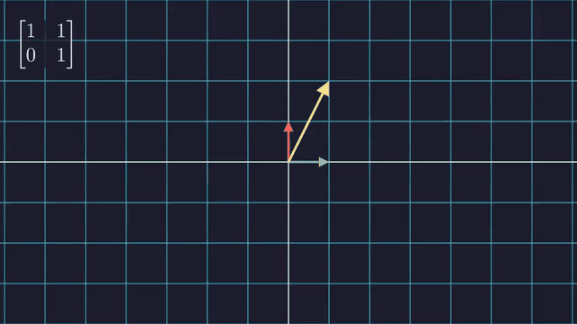
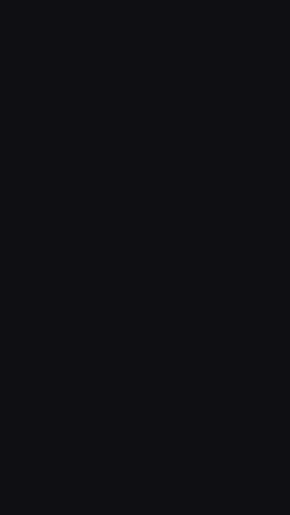

# 10. 실제 영상 만들기

> 예제: [`scenes/ch10_production.py`](scenes/ch10_production.py), [`scenes/ch10_shorts.py`](scenes/ch10_shorts.py)

1~9장은 "기능"을 다뤘습니다. 이 장은 **한 편의 영상을 만들고 관리하는 방법**을 다룹니다.

## Episode: 한 편의 영상 구조


```bash
uv run manim -pqh scenes/ch10_production.py Episode --save_sections
```

### ① 채널 스타일을 한 곳에서

```python
config.background_color = "#1e1e2e"   # 배경색
Text.set_default(font_size=36)         # 모든 Text의 기본값
MathTex.set_default(font_size=48)
ACCENT, SUB = "#f5c2e7", "#89b4fa"     # 팔레트 상수
```

팀 프로젝트라면 이 부분을 `style.py`로 분리하고 모든 장면 파일에서 `from style import *`로 가져오세요.

### ② 반복 요소는 컴포넌트 클래스로

```python
class Callout(VGroup):
    def __init__(self, text, color=ACCENT, **kwargs):
        super().__init__(**kwargs)
        label = Text(text, font_size=28)
        box = RoundedRectangle(width=label.width + 0.6, height=label.height + 0.4, ...)
        self.add(box, label)

def pop_in(mob, **kwargs):        # 재사용하는 애니메이션은 함수로
    return FadeIn(mob, scale=0.6, rate_func=rate_functions.ease_out_back, **kwargs)
```

### ③ 섹션, 소리, 자막

```python
self.next_section("intro")                         # --save_sections로 구간별 mp4가 따로 나옴
self.add_sound("assets/ding.wav")         # 현재 시점에 효과음
self.add_subcaption("자막 문장", duration=2)         # .srt 자막 파일이 같이 생성됨
```

- `--save_sections`를 주면 `media/videos/.../sections/Episode_0000_intro.mp4`처럼 구간별 파일이 생깁니다. 편집 툴로 옮기거나 발표용으로 쓰기 좋습니다.
- **소리와 자막은 mp4에만** 들어갑니다 (GIF에는 없음).
- ⚠️ 캐시된 애니메이션을 재사용하면 **소리가 빠지는 경우**가 있습니다. 최종 렌더는 `--disable_caching`으로 하세요.
- 내레이션을 코드와 동기화하려면 [manim-voiceover](https://voiceover.manim.community/) 플러그인을 살펴보세요.

### ④ `TransformMatchingShapes`

TeX 조각을 나누지 않아도 모양이 같은 글자끼리 알아서 매칭합니다. 식의 순서를 바꿀 때 편합니다.

## ExternalAssets: SVG와 이미지 가져오기


```python
SVGMobject("assets/rocket.svg")   # path마다 VMobject → Create, 색칠, 변형 가능
ImageMobject("photo.png")                  # 비트맵 (변형은 이동/회전/크기만)
ImageMobject(np_array)                     # numpy 배열을 바로
```

Figma나 Illustrator에서 만든 로고와 아이콘을 SVG로 내보내면 그대로 애니메이션할 수 있습니다.

## FlowField: 벡터장과 유선


```python
ArrowVectorField(func)                      # 화살표 벡터장
stream = StreamLines(func)
stream.start_animation(warm_up=True, flow_speed=1.5)   # 흐르는 애니메이션
```

## LinearMap: 선형대수 전용 Scene



```python
class LinearMap(LinearTransformationScene):
    def construct(self):
        self.add_vector([1, 2])
        self.apply_matrix([[1, 1], [0, 1]])
```

⚠️ v0.21 기준으로 `apply_matrix` 바로 앞에 `self.wait()`를 넣으면 전경 라벨과 ghost 벡터가 한 번 더 변환되는 문제가 있습니다.

## VerticalShort: 세로 영상 (쇼츠 / 릴스)



```python
# 파일 맨 위 (그 파일의 모든 Scene에 적용)
config.pixel_width, config.pixel_height = 1080, 1920
config.frame_width, config.frame_height = 9, 16
```

`frame_width`와 `frame_height`까지 바꿔야 좌표계도 세로로 바뀝니다. 화면 폭이 9밖에 안 되니 글자와 도형 크기를 다시 잡아야 합니다.

## 권장 작업 흐름

```
1. 스토리보드: 장면별로 "무엇을 보여줄지"를 한 줄씩 적는다
2. 장면 = Scene 클래스 하나 (30초~1분 단위로 짧게)
3. 작업 중엔 -ql, 레이아웃 확인은 -s, 긴 장면은 -n 으로 일부만
4. 공통 스타일과 컴포넌트는 style.py / components.py 로 분리
5. 최종: -qh --disable_caching, 필요하면 --save_sections
6. 편집 툴(Premiere, DaVinci, CapCut)에서 장면을 이어 붙이고 내레이션과 BGM 추가
   (배경 없이 합성하려면 -t 로 투명 mov)
```

## 🧩 빈칸 실습

위에서 본 예제 코드에 빈칸을 뚫었습니다. 실습 사이트(`index.html`)에서 열면 바로 채우고 채점할 수 있습니다.
GitHub에서 읽을 때는 `⟦정답⟧` 부분이 빈칸입니다.

```exercise
id: ch10-episode
title: 섹션·자막·컴포넌트로 한 편 만들기
scene: ch10_production.py Episode
gif: Episode
hint: 구간 나누기는 next_section, 자막은 add_subcaption, 효과음은 add_sound, 모양 기준 매칭은 TransformMatchingShapes.
---
from pathlib import Path

from manim import *

ASSETS = Path("assets")  # 저장소 폴더에서 실행한다고 가정

config.background_color = "#1e1e2e"
Text.set_default(font_size=36)
MathTex.set_default(font_size=48)

ACCENT = "#f5c2e7"
SUB = "#89b4fa"


class Callout(⟦VGroup⟧):
    """둥근 박스 안의 설명 문구. 영상 전체에서 같은 모양을 쓰고 싶을 때."""

    def __init__(self, text: str, color=ACCENT, **kwargs):
        super().__init__(**kwargs)
        label = Text(text, font_size=28)
        box = RoundedRectangle(
            corner_radius=0.2, width=label.width + 0.6, height=label.height + 0.4,
            stroke_color=color, fill_color=color, fill_opacity=0.15,
        )
        self.add(box, label)


class ChapterTitle(VGroup):
    def __init__(self, number: int, title: str, **kwargs):
        super().__init__(**kwargs)
        num = Text(f"Part {number}", font_size=28, color=SUB)
        name = Text(title, font_size=56, weight=BOLD)
        line = Line(LEFT * 3, RIGHT * 3, color=ACCENT)
        self.add(VGroup(num, name, line).arrange(DOWN, buff=0.25))


# ── 3. 재사용 가능한 애니메이션 = Animation 을 돌려주는 함수 ───────────
def pop_in(mob, **kwargs):
    return FadeIn(mob, scale=0.6, rate_func=rate_functions.ease_out_back, **kwargs)


def pop_in(mob, **kwargs):
    return FadeIn(mob, scale=0.6, rate_func=rate_functions.ease_out_back, **kwargs)


class Episode(Scene):
    """next_section 으로 구간을 나눈 '한 편의 영상'."""

    def construct(self):
        # ── 인트로
        self.⟦next_section⟧("intro")
        title = ChapterTitle(1, "피타고라스 정리")
        self.play(pop_in(title))
        self.⟦add_subcaption⟧("오늘은 피타고라스 정리를 봅니다.", duration=2)
        sound = ASSETS / "ding.wav"
        if sound.exists():
            self.⟦add_sound⟧(str(sound))
        self.wait(1.5)
        self.play(FadeOut(title, shift=UP))

        # ── 본문: 도형
        self.next_section("figure")
        tri = Polygon(ORIGIN, RIGHT * 3, UP * 2, color=WHITE).move_to(LEFT * 2)
        a_lab = MathTex("a").next_to(tri, LEFT)
        b_lab = MathTex("b").next_to(tri, DOWN)
        c_lab = MathTex("c").move_to(tri.get_center() + UR * 0.5)
        self.play(Create(tri), Write(VGroup(a_lab, b_lab, c_lab)))
        note = Callout("직각삼각형의 세 변").next_to(tri, RIGHT, buff=1)
        self.play(pop_in(note))
        self.add_subcaption("직각삼각형의 세 변을 a, b, c 라고 합시다.", duration=2)
        self.wait(1.5)

        # ── 본문: 식
        self.next_section("formula")
        eq = MathTex("a^2", "+", "b^2", "=", "c^2").next_to(tri, RIGHT, buff=1)
        self.play(FadeOut(note, shift=UP), Write(eq))
        self.play(Circumscribe(eq, color=ACCENT))

        # TransformMatchingShapes: TeX 조각 지정 없이 '모양'이 같은 글자끼리 매칭
        swapped = MathTex("c^2 = b^2 + a^2").move_to(eq)
        self.play(⟦TransformMatchingShapes⟧(eq, swapped, path_arc=PI / 2))
        self.wait()

        # ── 아웃트로
        self.next_section("outro")
        self.play(*[FadeOut(m) for m in self.mobjects])
        end = Callout("구독과 좋아요", color=SUB).scale(1.5)
        self.play(pop_in(end))
        self.wait()
```

```exercise
id: ch10-flow
title: 흐르는 벡터장
scene: ch10_production.py FlowField
gif: FlowField
hint: 화살표 벡터장은 ArrowVectorField, 흐르는 선은 StreamLines와 start_animation.
---
from manim import *

config.background_color = "#1e1e2e"


class FlowField(Scene):
    """ArrowVectorField + StreamLines: 물리/미분방정식 시각화."""

    def construct(self):
        def func(p):
            x, y = p[0], p[1]
            return np.array([np.sin(y), np.sin(x), 0]) * 0.8

        field = ⟦ArrowVectorField⟧(func, x_range=[-7, 7, 1], y_range=[-4, 4, 1])
        self.play(Create(field), run_time=1.5)
        self.wait(0.5)

        stream = ⟦StreamLines⟧(func, stroke_width=3, max_anchors_per_line=30, padding=1, colors=[BLUE, TEAL, YELLOW])
        self.play(FadeOut(field))
        self.add(stream)
        stream.⟦start_animation⟧(warm_up=True, flow_speed=1.5)
        self.wait(3)
        self.play(stream.⟦end_animation⟧())
```

```exercise
id: ch10-shorts
title: 세로 영상(9:16) 만들기
scene: ch10_shorts.py VerticalShort
gif: VerticalShort
hint: 쇼츠 해상도는 1080×1920. 화면 좌표도 폭 9 : 높이 16으로 맞춥니다.
---
from manim import *

config.pixel_width = ⟦1080⟧
config.pixel_height = ⟦1920⟧
config.frame_width = 9
config.frame_height = ⟦16⟧
config.background_color = "#101014"


class VerticalShort(Scene):
    def construct(self):
        hook = Text("1 + 2 + 3 + ... = ?", font_size=64).to_edge(UP, buff=1.5)
        self.play(Write(hook))

        dots = VGroup()
        for row in range(1, 7):
            dots.add(VGroup(*[Dot(radius=0.18, color=BLUE) for _ in range(row)]).arrange(RIGHT, buff=0.15))
        dots.arrange(DOWN, aligned_edge=LEFT, buff=0.15).move_to(ORIGIN)
        self.play(LaggedStart(*[FadeIn(r, shift=RIGHT) for r in dots], lag_ratio=0.2))

        # 180° 돌린 복사본을 맞물리면 n × (n+1) 직사각형이 된다
        step = dots[0][0].width + 0.15  # 점 하나 + 간격
        copy = dots.⟦copy⟧().set_color(ORANGE).rotate(⟦PI⟧)
        copy.align_to(dots, UP).align_to(dots, RIGHT).shift(RIGHT * step)
        self.play(⟦TransformFromCopy⟧(dots, copy, path_arc=PI / 2), run_time=1.5)
        self.play(VGroup(dots, copy).animate.move_to(ORIGIN))

        answer = MathTex(r"\frac{n(n+1)}{2}", font_size=96).to_edge(DOWN, buff=2)
        self.play(Write(answer))
        self.play(Circumscribe(answer, color=YELLOW))
        self.wait()
```

## ✍️ 최종 과제

여러분 영상의 첫 30초를 만들어 보세요.
1. `style.py`에 색상과 폰트 기본값을 정합니다.
2. `ChapterTitle`과 `Callout` 같은 컴포넌트를 2개 이상 만듭니다.
3. 인트로, 본문, 아웃트로를 `next_section`으로 나눕니다.
4. 지금까지 배운 것 중 최소 하나(수식 전개, updater, 그래프, 카메라 중 하나)를 본문에 넣습니다.
5. `-qh --save_sections --disable_caching`으로 렌더합니다.
